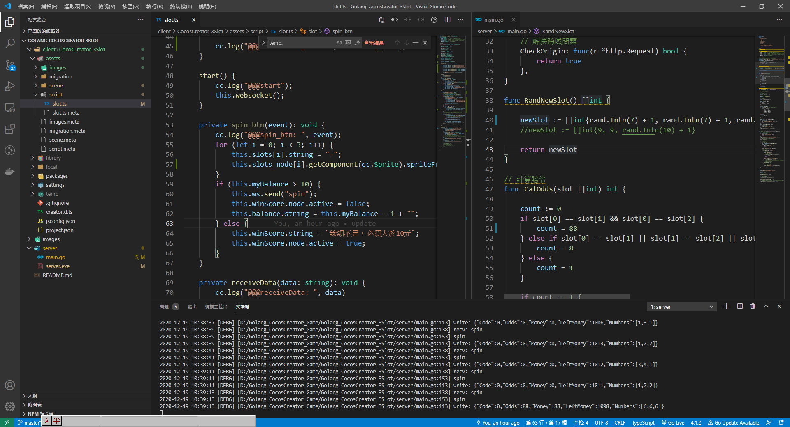
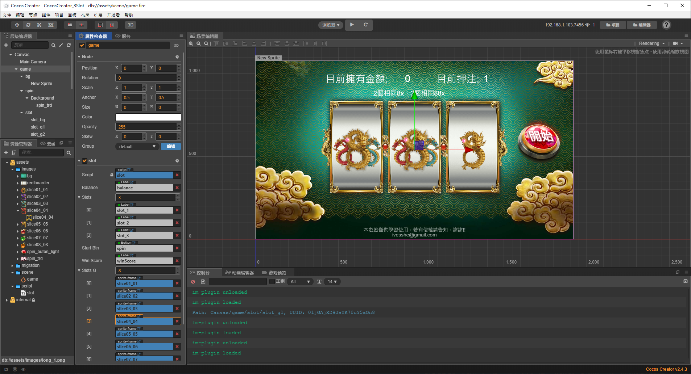
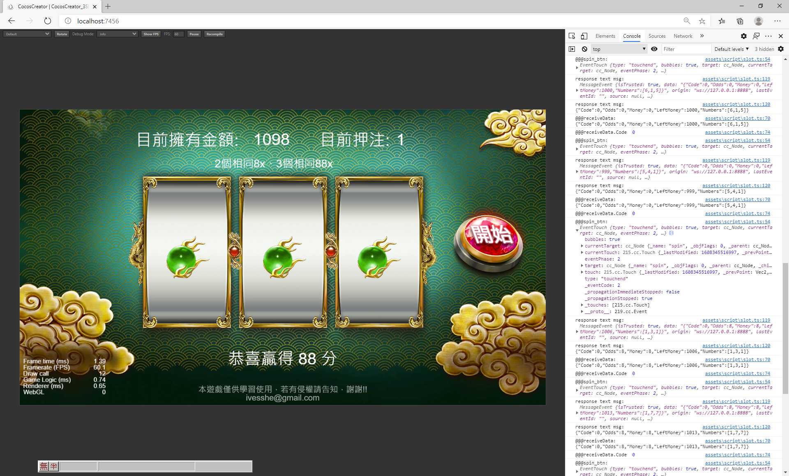

# 全端(棧) - Golang 搭配Cocos Creator2.4.3 製作簡易Slotgame

這是一個簡易的3輪1線的SlotGame(拉霸機)，素材是網路上找的，功能也未作到完善，只是作出基本的核心而已。

傳輸使用Websocket，Golang的部分只簡單使用第3方套件完成基本功能，尚未使用框架，之後可能考慮採用Golang LeafServer框架來寫服務器的代碼。

總之，這只是個簡易的demo而已。

之後有時間會製作其它遊戲的簡易版，例如牛牛、21點、斗地主之類，只取其中自己想展示的部分製作。

# 展示網址

搭配server/server.exe程式，可以順利在本地運行。

客戶端網址

https://ivesshe.github.io/Golang_CocosCreator_3Slot/

展示影片連結

https://www.youtube.com/watch?v=9yY7E3D1RO0&feature=youtu.be

# 開發畫面

Visual Studio Code 

左邊client代碼、右邊server代碼

下面bash，跑server服務

使用最新的Cocos Creator2.4.3

# 執行結果

